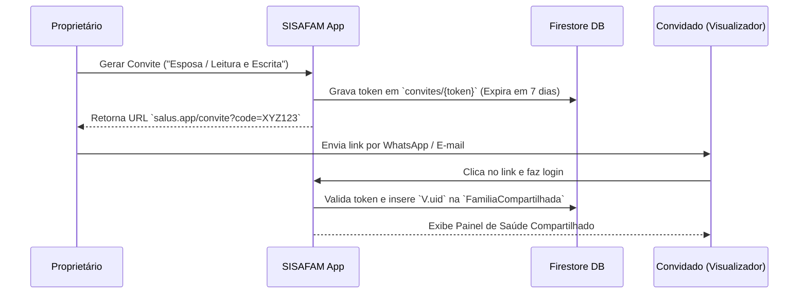

# RFC 008 — Compartilhamento de Acesso Familiar Multi-Usuário (SISAFAM)

**Status:** Aprovado / Especificação Técnica de Referência  
**Data:** 2026-08-01  
**Autor:** Equipe Antigravity IDE & SISAFAM  

---

## 1. Contexto & Problema

O SISAFAM gerencia perfis de saúde de seres humanos e pets de uma casa. No modelo atual, cada conta Firebase (`uid`) possui seus dados em `usuarios/{uid}/membros`. 

No mundo real, o cuidado de saúde é compartilhado entre familiares (ex: esposa e marido gerenciando a saúde dos filhos e dos pets, ou um filho adulto acompanhando os exames e receitas de pais idosos).

Existe a necessidade de permitir que múltiplos **Usuários Autenticados** (com contas próprias de login) acessem a **Mesma Família**, mantendo diferentes papéis de acesso e segurança sem duplicação de dados.

---

## 2. Conceitos Fundamentais

### 2.1. Membro Familiar vs. Usuário da Conta
- **Integrante da Família (Membro):** A entidade clínica/perfil de saúde (ex: "Gabriel (Filho)", "Thor (Cão)"). Não tem necessariamente um login ou e-mail.
- **Usuário da Conta (User):** Credencial de autenticação Firebase Auth (e-mail/Google) associada a uma pessoa física que utiliza o app.

### 2.2. Entidade Família Compartilhada (`FamiliaCompartilhada`)
```ts
export interface FamiliaCompartilhada {
  id: string;
  nome_familia: string;
  criado_em: string;
  proprietario_uid: string;
  membros_acesso: Array<{
    uid: string;
    email: string;
    papel: 'proprietario' | 'editor' | 'visualizador';
    adicionado_em: string;
  }>;
}
```

---

## 3. Matriz de Permissões (RBAC)

| Ação | Proprietário | Editor (ex: Esposa/Mãe) | Visualizador (ex: Filho/Cuidadora) |
|---|:---:|:---:|:---:|
| Ver Painel, Fichas e Gráficos | ✅ | ✅ | ✅ |
| Baixar Ficha Médica PDF / Link | ✅ | ✅ | ✅ |
| Adicionar/Editar Exames e Receitas | ✅ | ✅ | ❌ |
| Adicionar/Editar Meds e Condições | ✅ | ✅ | ❌ |
| Convidar Novos Membros da Família | ✅ | ❌ | ❌ |
| Excluir Integrantes ou Apagar Conta | ✅ | ❌ | ❌ |

---

## 4. Fluxo de Convite & Conexão



---

## 5. Regras de Segurança Firestore (Security Rules)

```javascript
rules_version = '2';
service cloud.firestore {
  match /databases/{database}/documents {
    
    // Função auxiliar para checar se o usuário tem acesso à família
    function temAcessoFamilia(familiaId, papelRequerido) {
      let famDoc = get(/databases/$(database)/documents/familias/$(familiaId));
      return request.auth != null && (
        famDoc.data.proprietario_uid == request.auth.uid ||
        (papelRequerido == 'leitura' && request.auth.uid in famDoc.data.uids_visualizadores) ||
        (papelRequerido == 'escrita' && request.auth.uid in famDoc.data.uids_editores)
      );
    }
  }
}
```

---

## 6. Conclusão & Próximos Passos
Esta especificação estabelece os alicerces para o compartilhamento seguro e resiliente entre contas familiares, mantendo controle granular sobre a visualização e edição de registros clínicos sensíveis.
